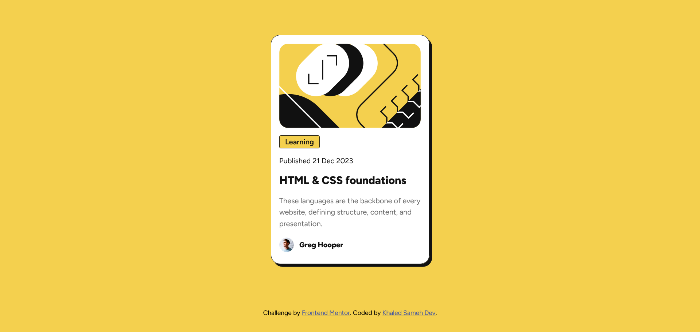

# Frontend Mentor - Blog preview card solution

This is a solution to the [Blog preview card challenge on Frontend Mentor](https://www.frontendmentor.io/challenges/blog-preview-card-ckPaj01IcS). Frontend Mentor challenges help you improve your coding skills by building realistic projects.

## Table of contents

- [Overview](#overview)
  - [The challenge](#the-challenge)
  - [Screenshot](#screenshot)
  - [Links](#links)
- [My process](#my-process)
  - [Built with](#built-with)
  - [What I learned](#what-i-learned)
- [Author](#author)

## Overview

### The challenge

practice from Frontend Mentor :

- build intractive blog card preview

### Screenshot

## My process

### Built with

- Semantic HTML5 markup
- CSS custom properties
- Flexbox
- Mobile-first workflow

### What I learned

usage of font files

## Author

- LinkedIn - [Khaled Sameh](https://www.linkedin.com/in/khaled-sameh-940295272/)
- Frontend Mentor - [@khaled-sameh-dev](https://www.frontendmentor.io/profile/khaled-sameh-dev)
- Gmail - [khaledsameh158@gmail.com](https://khaledsameh158@gmail.com)
